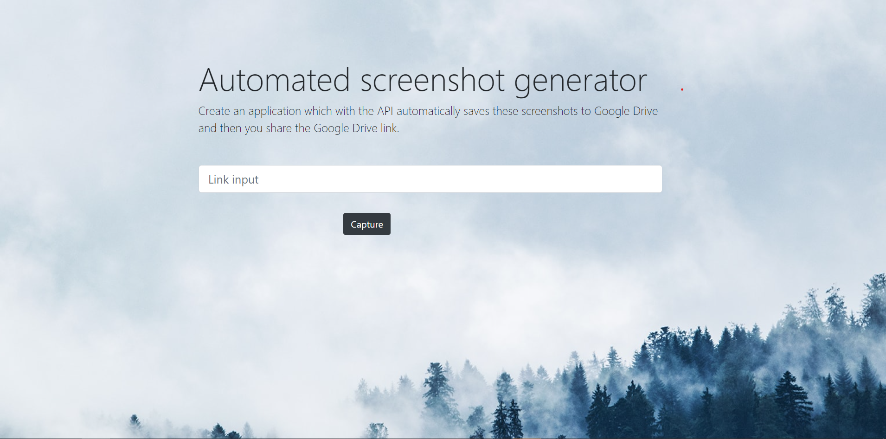

# Automated-screenshot-generator
 

 
Your task for the case study is to create an automated tool for taking screenshots of homepages of five selected webpages. There is a tool https://www.screenshotmachine.com/, which automatically creates these screenshots and even has an API. Please get familiar with this tool and the API and create an application which with the API automatically saves these screenshots to Google Drive and then you share the Google Drive link with us. After you finish the case study upload your code to GitHub (or similar) and share it with us. Please ensure that the code is publicly accessible

Files Format:
Use screenshot width: 1920 pixels and height of 1080 pixels, Image format JPG. Use the following structure of creating the name of the screenshot file “ID_name.jpg. 

PS. screenshot filename is saved as ID_Date.now() 

I used puppetteer as i thought it will be the fastet and easiest way.
Do not forget you need the node_modules to run

# Steps:
  1. Install node js library   
  2. Open powershell comand   
  3. Configure the instalation   
  4. npm check if you have the needed tools   

    4.1. install npm  
    4.2 npm  install --save-dev nodemon   
    4.3. npm install puppeteer   
  5.  npm start   

  Create a js file where you will type your solution

# PS. Run only the index.html file

  

